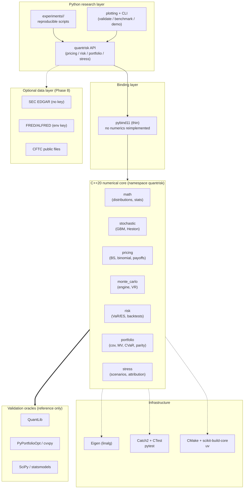

# QuantRisk++ — Architecture (Phase 0, frozen v0.1)

Date: 2026-09-25 · Status: **DESIGN ONLY — no code exists.**
See `project_scope.md` (why), `mathematical_specification.md` (what),
`validation_protocol.md` (how we prove it).

## 1. System diagram



ASCII fallback (if mermaid is unavailable):

```text
Python research layer (API / experiments / plotting / CLI)
        │ pybind11 (thin bindings, no duplicated numerics)
        ▼
C++20 core: math | stochastic | pricing | monte_carlo | risk | portfolio | stress
        ├── Eigen (linear algebra) · Catch2/CTest + pytest (tests)
        └── CMake + scikit-build-core + uv (build/packaging)
Validation oracles (one-way): QuantLib, PyPortfolioOpt/cvxpy, SciPy
Optional data (one-way, cached): SEC EDGAR, FRED/ALFRED, CFTC
```

## 2. Layer responsibilities (frozen)

| Layer | Owns | Must NOT |
|---|---|---|
| C++20 core (`cpp/`, `namespace quantrisk`) | all numerics: distributions, RNG discipline, GBM/Heston paths, BS/binomial, MC engine + variance reduction, VaR/ES + backtests, covariance + optimizers, scenario math | touch network; depend on Python; duplicate Eigen linalg; hold global RNG state |
| Bindings (`bindings/`) | thin pybind11 exposure of frozen C++ APIs | reimplement formulas; add validation logic |
| Python (`python/quantrisk/`) | orchestration: the `data/`, `experiments/` and `plotting/` packages, and one facade module per domain — `pricing`, `stats`, `monte_carlo`, `stochastic`, `risk`, `portfolio`, `stress`, `special`, plus `api.py`'s `BlackScholes`/`MonteCarloEngine`/`RiskEngine`/`PortfolioOptimizer`/`ScenarioEngine` and the CLI | shadow C++ numerics with second implementations |
| Tests (`tests/cpp`, `tests/python`) | Catch2 (C++) + pytest (Python), incl. C++/Python consistency | depend on network; hard-code oracle outputs |
| Benchmarks (`benchmarks/`) | live-oracle comparisons + performance measurements | feed results back into `tests/` as constants |
| Experiments (`experiments/`) | fixed-command scripts → CSV/JSON + plots | hand-edited figures; unseeded runs |
| Data (`data/`) | cached downloads + metadata + offline fixtures | large binaries in git; key/secrets in repo |
| Docs/paper (`docs/`, `paper/`) | scope, math spec, protocol, model cards, limitations, technical report | claims without artifacts |

### The Python face of each C++ submodule (Phase 9)

`_quantrisk` binds its submodules as *attributes* only, so `sys.modules["quantrisk.risk"]`
is never populated and `from quantrisk.risk import X` cannot resolve. Phase 9 gave each of
the eight submodules a small Python file that re-exports the extension's public names and,
for `pricing`/`risk`/`portfolio`/`stress`, carries the facade class. The files contain no
arithmetic and no control flow — a `test_statistics_module_is_not_a_python_reimplementation`
AST walk enforces that structurally, which is a stronger guard than the module-identity
check it replaced.

Two consequences are intentional and load-bearing:

* `module.__core__` on each face names the extension object it mirrors, so a test can
  assert a value came from C++ rather than from a Python approximation.
* `import quantrisk` does **not** import `quantrisk.data`. The data layer reaches the
  network, and pulling it in at package import would make every numerical user carry that
  surface and its failure modes. Verified in a fresh interpreter, not by inspecting the
  current one.

## 3. Dependency direction (one-way, frozen)

```text
experiments → python API → bindings → C++ core → Eigen
tests ─────────────────────────────→ C++ core / python API
benchmarks → C++ core / python API + oracles (QuantLib, PyPortfolioOpt/cvxpy, SciPy)
data ──────→ python API only (never into C++ core)
```

Oracles never become dependencies of the core. Data never becomes a
dependency of tests.

## 4. Build & packaging plan (to be realized in Phase 1)

- One CMake definition (`CMakeLists.txt` + `CMakePresets.json`): core library,
  pybind11 module, Catch2 tests, CTest registration.
- `pyproject.toml` with `scikit-build-core` backend builds the same CMake tree;
  `uv sync` → `pytest` is the documented dev loop alongside
  `cmake --preset … / cmake --build … / ctest …`.
- Phase 1 smoke surface (frozen): `quantrisk.version()`,
  `quantrisk.normal_cdf(0.0)` — proves the full C++ → binding → Python path.

## 5. Repository layout, as it actually is

Verified by `test_every_path_the_architecture_document_declares_exists`, which reads the fenced block
below and fails if any path it names is missing from the tree. Three deliberate departures from the
`PROJECT_SPEC.md` §6 target are stated under the block rather than hidden by editing the target.

```text
CMakeLists.txt · CMakePresets.json · pyproject.toml · README.md · LICENSE · CITATION.cff · CONTRIBUTING.md
cpp/include/quantrisk/{core,math,stochastic,pricing,monte_carlo,risk,portfolio,stress}/
cpp/src/ · bindings/python_bindings.cpp
python/quantrisk/{data,experiments,plotting}/ · python/quantrisk/{pricing,stats,monte_carlo,stochastic,risk,portfolio,stress,special}.py
tests/{cpp,python}/ · benchmarks/{quantlib,pyportfolioopt,performance}/
experiments/{pricing_validation,monte_carlo_convergence,variance_reduction,linearisation_error_bound,
  two_factor_error_bound,var_backtesting,portfolio_optimization,stress_testing,real_data_risk_study}/
data/fixtures/ · docs/ (this file set + model_cards/, analysis/, phase_reports/) · paper/ ·
evidence/ · scripts/ · .github/workflows/
```

**Departures from the §6 target, and why.** `data/sample/` became `data/fixtures/` (committed real
responses with provenance sidecars, which a "sample" directory does not describe); downloads land in `data/cache/`, which is git-ignored, created at runtime, and therefore deliberately not
listed above. The Python facades are **one module per domain** rather than an
`analytics/` package: the domain names are the public API, so flattening them made `quantrisk.pricing`
and friends the same path in Python and in the C++ namespace, and an `analytics/` level would have put
a synonym between a user and the thing they asked for. A previous revision of this very table claimed
`analytics/` existed — it never did, and the guard above is what makes that class of sentence
impossible to repeat. `evidence/` and the three extra `experiments/` members are later phases, which is
what "grows per phase" was for.

Phase 0 creates only `docs/` (+ this spec). Empty scaffold files are banned;
directories appear with the phase that fills them.

## 6. Interface-freeze policy

- Phase 1 freezes: `namespace quantrisk`, numeric types, RNG abstraction,
  `normal_cdf`, `version()`.
- Phase 2 freezes: `OptionType / EuropeanOption / MarketParams / PricingResult`.
- Each freeze is recorded in that phase's report; later changes require a
  written migration note. Nothing is frozen yet (Phase 0).
